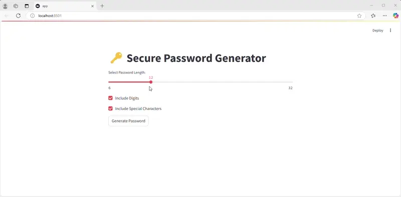

# 🔑 Secure Password Generator

A simple password generator that allows users to customize password length, include numbers, and special characters.

## 🚀 Features
- ✅ Generate secure passwords with custom length
- ✅ Option to include numbers and special characters
- ✅ Password strength evaluation
- ✅ Simple UI using Streamlit (optional)
- ✅ CLI-based execution
- ✅ Unit tests for reliability

---

## 📦 Installation
### **1️⃣ Clone the Repository**
```bash
git clone https://github.com/nagakirankasi/Password-Generator.git
cd Password-Generator
```

### **2️⃣ Install Dependencies (Optional for UI Version)**
```bash
pip install -r requirements.txt
```
**Example `requirements.txt` (if using Streamlit)**:
```
streamlit
```

---

## 🔧 Usage
### **1️⃣ Run in CLI Mode**
To generate a password with the default settings:
```bash
python password_generator.py
```
To customize password length and character options:
```python
from password_generator import generate_password
print(generate_password(length=16, use_digits=True, use_special_chars=True))
```

### **2️⃣ Run with Streamlit UI** (Optional)
To launch the web UI:
```bash
streamlit run app.py
```
Use the sliders and checkboxes to customize the password before generating.

---

## 🔍 Password Strength Evaluation
The password generator now includes **password strength evaluation**, which rates passwords as:
- **Weak** (Length < 8, missing numbers or special characters)
- **Moderate** (Length 8-12, missing special characters or numbers)
- **Strong** (Length > 12, includes numbers & special characters)

Example usage:
```python
from password_generator import evaluate_password_strength
print(evaluate_password_strength("P@ssw0rd123!"))  # Output: Strong
```

---

## 🧪 Running Tests
To ensure the password generator works correctly, run:
```bash
python -m unittest discover tests
```
## 🧪 Demo



---

## 📜 License
This project is licensed under the **MIT License**.

---

## 📢 Contributing
Feel free to fork this repository and submit **pull requests** to improve the project!

### 🔥 Future Enhancements
- Implement secure password storage options
- Support passphrase generation

---

Made with ❤️ to keep your passwords **safe & secure!** 🔐

